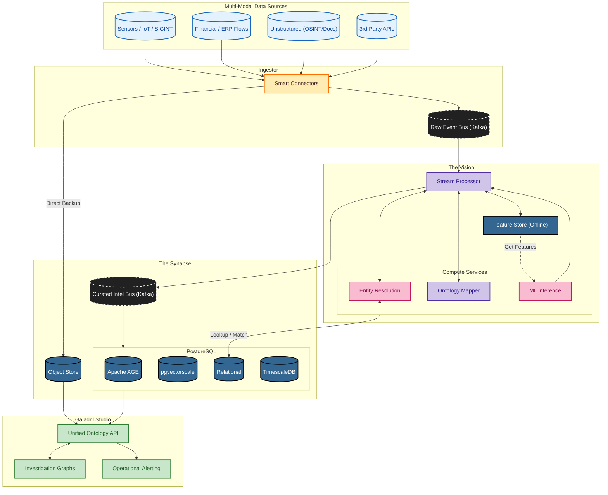

# Galadril ⛲️

[Documentation](https://realhinome.github.io/Galadril/) | 
[GitHub](https://github.com/RealHinome/Galadril)

> *"Things that were, and things that are, and some things that have not yet
> come to pass."*

**Galadril** is an advanced data integration and analytical intelligence
platform designed to provide a "Mirror" of complex systems. Galadril focuses
on **elucidation, foresight, and transparency**.

> [!CAUTION]
> This project is still in its early stages.

## Development
Enter the shell to load the environment:
```bash
nix develop github:RealHinome/Galadril?dir=infrastructure/nix
```

## Targeted architecture



### ESKG-enhanced GraphRAG

Galadril implements a reasoning framework based on the Event-State Knowledge
Graph (ESKG), as described in
[Zang et al. (2026)](https://doi.org/10.1016/j.eswa.2026.131938).

Its core transition pattern is:

$$
S_t \xrightarrow{Triggers} E_t \xrightarrow{LeadsTo} S_{t+1}
$$

A state enables an event, the event produces a new state, and the graph grows
with this history. This makes state changes traceable rather than simply
overwriting the previous value.

The base ESKG defines six relations:

| Relation                      | Meaning                                                      |
| ----------------------------- | ------------------------------------------------------------ |
| `Triggers` ($S \rightarrow E$)  | A state enables or activates an event.                       |
| `LeadsTo` ($E \rightarrow S$)   | An event produces a resulting state.                         |
| `Evolution` ($S \rightarrow S$) | A state directly evolves into another state.                 |
| `Contain` ($E \rightarrow E$)   | An event contains or decomposes into other events.           |
| `Occur` ($E \rightarrow P$)     | An event occurs at or is associated with a physical entity.  |
| `Influence` ($E \rightarrow P$) | An event affects a physical entity or one of its properties. |

Galadril extends this model with Latent Identity ESKG. It therefore keeps
evidence and identity hypotheses separate from authoritative graph facts until
a resolution decision is made.

Its additional relations describe that resolution process:

| Relation                 | Meaning                                                                     |
| ------------------------ | --------------------------------------------------------------------------- |
| `hasInference`           | Links an observation to its inference result.                               |
| `consideredCandidate`    | Records identities considered during inference.                             |
| `hasDecision`            | Links an inference to the resulting decision.                               |
| `selectedTarget`         | Records the identity selected by that decision.                             |
| `promotedAs`             | Resolves a latent identity into an authoritative entity.                    |
| `mergedWith`             | Versionably merges two latent identity hypotheses.                          |
| `supersedes` / `revokes` | Replaces or invalidates an earlier interpretation without deleting history. |

Amarth adds a derived `CAUSES` relationship after time-windowed causal
inference. Unlike the base semantic `Influence` relation, `CAUSES` carries
quantitative evidence: FDR-corrected confidence, effect size, lag, window
bounds, method, and source observation provenance. Relationships are versioned
by inference window and can seed DoWhy structural causal models for
intervention and counterfactual simulation.

## License

This project is licensed under the terms of the BSD 3-Clause License. See the
[LICENSE](/LICENSE) file for the full license text.
