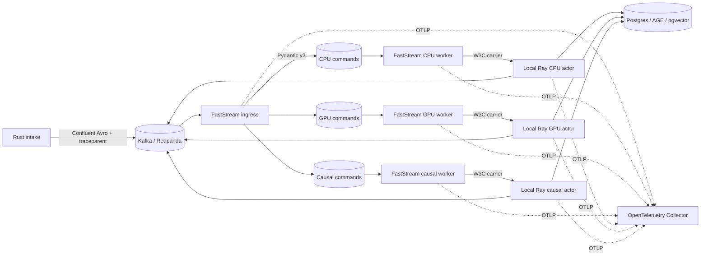

# Galadril Vision

Galadril Vision is a real-time, multi-tenant pipeline for multimodal inference,
entity resolution, graph persistence, and causal analysis.

## Architecture

FastStream owns Kafka/Redpanda consumption, Pydantic v2 validation, routing,
acknowledgements, retry publication, and W3C trace extraction. Long-running,
CPU-heavy, and GPU-heavy operations execute in named Ray actors. Kafka delivery
is at least once; the Postgres execution ledger and deterministic command IDs
provide logical idempotency.



The services are split by role so Kafka partitions provide bounded consumer
concurrency. Each worker owns a single-node Ray runtime and actor pool; no Ray
head or worker containers are required. Multi-node Ray is intentionally deferred
until the services run under Kubernetes. A message is acknowledged only after
confirmed downstream/DLQ publication.

## Observability

- Incoming W3C `traceparent` headers are extracted automatically by FastStream.
- The current context is serialized explicitly for Ray and extracted before the
  actor span starts, preserving the Trace ID across the process boundary.
- FastStream and pipeline latency, throughput, and active Ray task instruments
  are pushed directly to the OpenTelemetry Collector over OTLP.
- OTLP traces, metrics, and logs flow through the collector to Jaeger,
  Prometheus, and Loki. Prometheus scrapes only the collector's translated
  metrics endpoint; Vision does not run an HTTP server.
- JSON logs include `trace_id`, `span_id`, `entity_id`, `pipeline`, and `step`.

## Running locally

```bash
docker compose -f infrastructure/docker/docker-compose.yaml up
```

Enable the GPU Vision service where NVIDIA container support is available:

```bash
docker compose -f infrastructure/docker/docker-compose.yaml --profile gpu up
```

Vision workers expose no HTTP ports. Their running container state is the local
liveness signal, while Kafka consumer activity and OTLP telemetry provide
readiness and execution visibility. Jaeger is `:16686`, Prometheus is `:9090`,
and Grafana is `:3005`.
