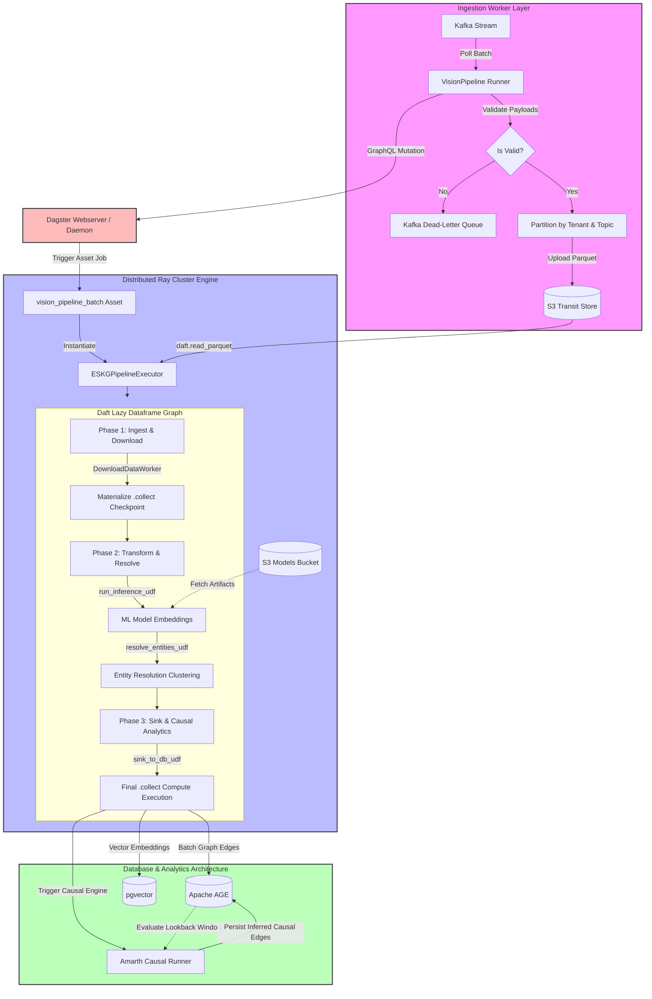

# Galadril Vision

AI pipeline for predicting and linking (ontology) data.
This is the true Mirror of Galadriel.

> *"Many things I can command the Mirror to reveal,’ she answered. ‘And to some
> I can show what they desire to see. But the Mirror will also show things
> unbidden, and those are often stranger and more profitable than things which
> we wish to behold. What you will see, if you leave the Mirror free to work, I
> cannot tell. For it shows things that were, and things that are, and things
> that yet may be. But which it is that he sees, even the wisest cannot always
> tell."*

## Architecture

Galadril Vision uses a distributed, multi-tenant orchestration architecture for
multi-modal inference, entity resolution, and causal analysis. The stack
bridges real-time stream consumption with distributed batch query capabilities
using three core framework pillars:
1. **Dagster:** Handles lifecycle orchestration, tracking, and scheduling.
2. **Daft:** Performs parallel data processing and lazy dataframe
    transformation.
3. **Ray:** Serves as the distributed backing cluster for Daft's execution
    layer (`daft.set_runner_ray`). It handles resource isolation for model
    workloads via designated inference pools.

