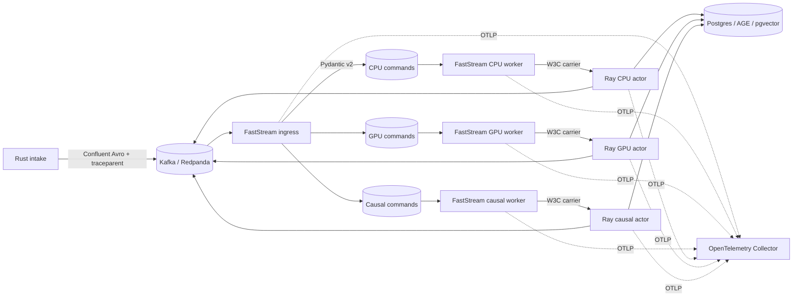

# Galadril Vision

Galadril Vision is a real-time, multi-tenant pipeline for multimodal inference,
entity resolution, graph persistence, and causal analysis.

## Architecture

FastStream owns Kafka/Redpanda consumption, Pydantic v2 validation, routing,
acknowledgements, retry publication, and W3C trace extraction. Long-running,
CPU-heavy, and GPU-heavy operations execute in named Ray actors. Kafka delivery
is at least once; the Postgres execution ledger and deterministic command IDs
provide logical idempotency.



Docker Compose runs one `vision` process with all FastStream roles and an
embedded single-node Ray runtime. On Kubernetes, the same image can be split by
role and connected to one shared KubeRay cluster through Ray Client. A message
is acknowledged only after confirmed downstream/DLQ publication.

## Observability

- Incoming W3C `traceparent` headers are extracted automatically by FastStream.
- The current context is serialized explicitly for Ray and extracted before the
  actor span starts, preserving the Trace ID across the process boundary.
- FastStream and pipeline latency, throughput, and active Ray task instruments
  are pushed directly to the OpenTelemetry Collector over OTLP.
- OTLP traces, metrics, and logs flow through the collector to Jaeger,
  Prometheus, and Loki. Prometheus scrapes only the collector's translated
  metrics endpoint; Vision does not run an HTTP server.
- JSON logs include `trace_id`, `span_id`, `entity_id`, `pipeline`, and `step`.

## Running locally

```bash
docker compose -f infrastructure/docker/docker-compose.yaml up
```

The local stack leaves `RAY_ADDRESS` empty, so the Vision process starts Ray
inside its own container. The GPU actor reserves a Ray GPU only when local Ray
detects one; CPU-only and Apple Silicon machines can therefore use the models'
CPU/MPS fallback instead of leaving the actor permanently unschedulable.

For KubeRay, expose the head pod's Ray Client port and inject an address into
each FastStream deployment:

```yaml
env:
  - name: RAY_ADDRESS
    value: ray://galadril-ray-head-svc:10001
```

The same endpoint can be stored under `ray.address` in `pipeline.yaml`; the
non-empty `RAY_ADDRESS` environment variable takes precedence. Cluster mode
does not pass local CPU/GPU limits or start a dashboard. Set
`ray.gpu_actor_num_gpus: 0` for a CPU-only KubeRay cluster; its default is `1`
in shared-cluster mode so the KubeRay autoscaler sees GPU demand.

The KubeRay head and worker images must use a Ray version compatible with the
Vision client and contain the Galadril actor code plus its runtime dependencies.
This is required because Ray executes the serialized actor classes in those
worker pods, not in the lightweight FastStream deployment.

Vision exposes no HTTP port. Its running container state is the local
liveness signal, while Kafka consumer activity and OTLP telemetry provide
readiness and execution visibility. Jaeger is `:16686`, Prometheus is `:9090`,
and Grafana is `:3005`.
