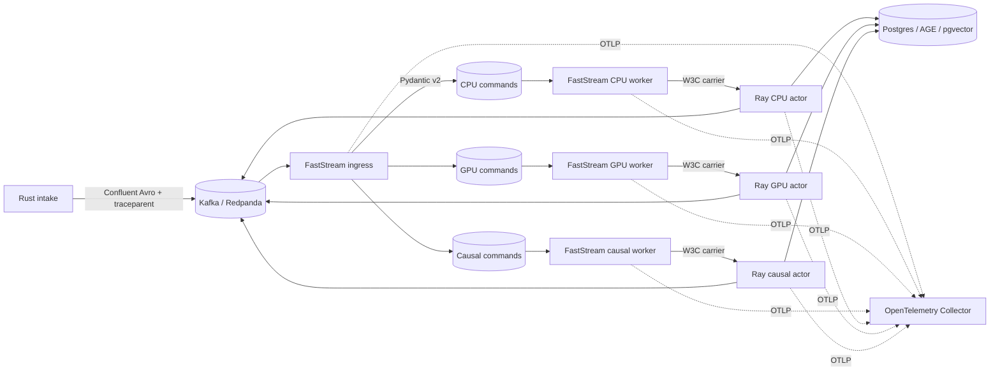

# Galadril Vision

Galadril Vision is a real-time, multi-tenant pipeline for multimodal inference,
entity resolution, graph persistence, and causal analysis.

## ESKG causal analysis

Scheduled causal workers materialize a tenant-scoped `ObservationWindow` from
raw ESKG events, state values, pgvector embeddings, and existing ontology or
derived relationships. Amarth jointly scalarizes these modalities, discovers
directional lagged dependencies with Tigramite PCMCI, and validates requested
effects with DoWhy.

## Probabilistic identity resolution

Set `identity_resolution.ledger_root` to durable storage in production. Without
it, LI-ESKG uses an in-memory ledger suitable only for local development. Until
tenant-sharded LI-ESKG actor ownership is introduced, identity resolution also
requires `ray.actor_replicas: 1`; configuration validation rejects unsafe
multi-writer runtimes. A representative configuration is:

```yaml
identity_resolution:
  enabled: true
  ledger_root: /var/lib/galadril/licorne
  candidate_top_k: 8
  h3_resolution: 9
  h3_ring_size: 1
  vector_similarity_midpoint: 0.85
  vector_similarity_scale: 12.0
  vector_weight: 1.0
  pipeline_probability_weight: 1.0
  candidate_log_prior: 0.0
  new_log_prior: 0.0
  noise_log_prior: -4.0
```

## Architecture



## Observability

- Incoming W3C `traceparent` headers are extracted automatically by FastStream.
- The current context is serialized explicitly for Ray and extracted before the
  actor span starts, preserving the Trace ID across the process boundary.
- FastStream and pipeline latency, throughput, and active Ray task instruments
  are pushed directly to the OpenTelemetry Collector over OTLP.
- OTLP traces, metrics, and logs flow through the collector to Jaeger,
  Prometheus, and Loki. Prometheus scrapes only the collector's translated
  metrics endpoint; Vision does not run an HTTP server.
- JSON logs include `trace_id`, `span_id`, `entity_id`, `pipeline`, and `step`.
