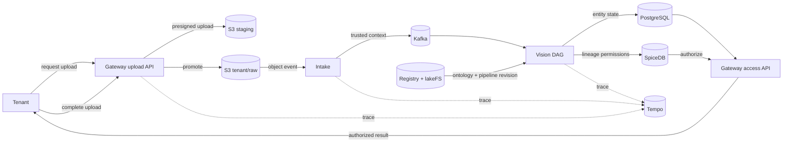

# Galadril tests 🧪

## Run

```bash
bazel test //tests/...
```

## Tests

| Target | Coverage |
| --- | --- |
| `//tests/e2e:e2e_support_test` | E2E orchestration contracts. |
| `//tests/e2e:pipeline_lifecycle_test` | Gateway-to-Gateway data lifecycle. |

## E2E data flow


