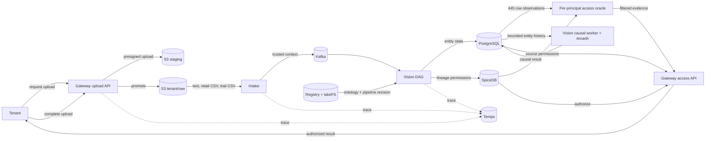

# Galadril tests 🧪

## Run

```bash
bazel test //tests/...
```

## Tests

| Target | Coverage |
| --- | --- |
| `//tests/e2e:e2e_support_test` | E2E orchestration contracts. |
| `//tests/e2e:e2e_causal_fixture_test` | Deterministic identity and randomized-effect oracle. |
| `//tests/e2e:e2e_empirical_data_test` | Pinned retail and randomized-trial extracts. |
| `//tests/e2e:e2e_scenario_test` | Multi-principal retail and trial row oracles. |
| `//tests/e2e:pipeline_lifecycle_test` | Gateway lifecycle, 445 empirical rows, access projections, and Amarth. |

The lifecycle checks JWT rejection, tenant and object authorization, upload-key
ownership, path traversal, GraphQL depth and body limits, search isolation,
revocation, lineage, and trace propagation. These cover applicable parts of the
[OWASP API Security Top 10](https://api-security.owasp.org/editions/2023/en/0x00-header/)
without claiming that one E2E scenario proves every risk category. The causal
branch sends 36 distinct Gateway uploads (30 concordant, six decoys), requires
LI-ESKG to retain two separate identities, and runs the actual Amarth worker
over the resulting bounded history; AI inference remains deterministic.
The empirical branch adds 36 retail files from six uploaders, 240 source rows,
24 expected identities, domain-scoped readers, exact-object exceptions, and a
205-row randomized trial. The trial estimate is calculated by Amarth from
Vision-persisted observations and compared with a source-independent oracle.
Its data provenance and authorization matrix are documented in
[the empirical E2E scenario](e2e/SCENARIO.md).

## E2E data flow


```mermaid
flowchart LR
    Tenant["Tenant"] -->|"request upload"| GatewayUpload["Gateway upload API"]
    GatewayUpload -->|"presigned upload"| Staging[("S3 staging")]
    Tenant -->|"complete upload"| GatewayUpload
    GatewayUpload -->|"promote"| Raw[("S3 tenant/raw")]
    Raw -->|"text, retail CSV, trial CSV"| Intake["Intake"]
    Intake -->|"trusted context"| Kafka[("Kafka")]
    Registry[("Registry + lakeFS")] -->|"ontology + pipeline revision"| Vision["Vision DAG"]
    Kafka --> Vision
    Vision -->|"entity state"| PostgreSQL[("PostgreSQL")]
    PostgreSQL -->|"445 row observations"| AccessOracle["Per-principal access oracle"]
    SpiceDB -->|"source permissions"| AccessOracle
    AccessOracle -->|"filtered evidence"| GatewayAccess
    PostgreSQL -->|"bounded entity history"| Amarth["Vision causal worker + Amarth"]
    Amarth -->|"causal result"| PostgreSQL
    Vision -->|"lineage permissions"| SpiceDB[("SpiceDB")]
    PostgreSQL --> GatewayAccess["Gateway access API"]
    SpiceDB -->|"authorize"| GatewayAccess
    GatewayAccess -->|"authorized result"| Tenant

    GatewayUpload -.->|"trace"| Tempo[("Tempo")]
    Intake -.->|"trace"| Tempo
    Vision -.->|"trace"| Tempo
```
